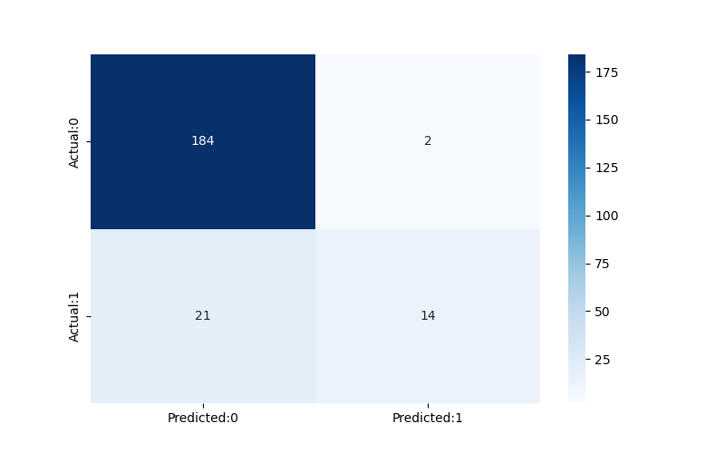

# Attrition Prediction
(Resignation Prediction)

## Content
This is the capstone project for a data science immersive student. (DSI-1128)

## Problem Statements
1. Employee attrition is a significant challenge for many organizations, leading to increased costs and decreased productivity. 
2. The sample company has experienced a high employee turnover rate, and we want to develop an attrition prediction model that can identify employees at risk of leaving the company. 
3. This project aims to develop a predictive model that can accurately identify employees who are likely to leave, allowing the company to take proactive measures to retain valuable employees and reduce the negative impact of attrition on the organization.
4. Goal of this project is to improve F1-score by 20% from the baseline model.

## File
1. "README.md" (this file): explain the concept and contents of the project
2. Code folder: Contain all the coding, Data preparation, EDA, Baseline model, Feature selection model, and Hyper tuning model. And also contain pickle files of splitter train & test data which are already processed with Column Transfer.
3. Data folder: employee_data.csv: Original file from Kaggle, and the other files are files for transferring data between notebooks.
4. Image folder: Contains images for putting in the presentation.
5. Streamlit folder: File to use with Streamlit on both the local machine and online(streamlit.io).
6. "Capstone Project Attrition Prediction Resignation Prediction.pdf": Presentation slides.
7. LICENSE: Using MIT License 

## Data Dictionary
|Feature               |Type   |Description|
|---                   |---    |---    |
|Age|int64|Age (unit range 18-60)
|Attrition|object|Employee leaving the company (0=no, 1=yes)
|BusinessTravel|object|1=No Travel, 2=Travel Frequently, 3=Travel Rarely
|DailyRate|int64|Salary level (unit range 102-1499)
|Department|object|Human Resources, Research & Development, Sales
|DistanceFromHome|int64| Employee home distance from the office (unit range 1-29)
|Education|int64| Level of education (unit range 1-5)
|EducationField|object| Human Resources, Technical Degree, Medical, Life Sciences, Marketing, Other
|EmployeeCount|int64|Number of Employee for each observation(All are 1)
|EmployeeNumber|int64|Employee Identification Number
|EnvironmentSatisfaction|int64| Employee satisfaction with the company's environment (unit range 1-4)
|Gender|object|Male, Female
|HourlyRate|int64|Hourly salary (unit range 30-100)
|JobInvolvement|int64| Employee involved in job (unit range 1-4)
|JobLevel|int64|Level of job (unit range 1-5)
|JobRole|object| Employee role: Human Resources, Research Director, Manufacturing Director, Healthcare Representative, Sales Executive, Sales Representative, Manager, Research Scientist, Laboratory Technician
|JobSatisfaction|int64|Satisfaction with the job (unit range 1-4)
|MaritalStatus|object|1=Divorced, 2=Married, 3=Single
|MonthlyIncome|int64|Monthly salary
|MonthlyRate|int64|Monthly rate
|NumCompaniesWorked|int64|Number of companies worked at (unit range 1-9)
|Over18|object|Y=yes, N=no (All are Y)
|OverTime|object|1=yes, 0=no
|PercentSalaryHike|int64|Percentage increase in salary
|PerformanceRating|int64|Performance rating (unit range 3-4)
|RelationshipSatisfaction|int64|Relations satisfaction (unit range 1-4)
|StandardHours|int64|Standard hours (all are 80)
|StockOptionLevel|int64|Stock options (unit range 0-3)
|TotalWorkingYears|int64|Total years worked (unit range 0-40)
|TrainingTimesLastYear|int64|Hours spent training last year (unit range 0-6)
|WorkLifeBalance|int64|Time spent between work and outside (unit range 1-4)
|YearsAtCompany|int64|Total number of years at the company (unit range 0-40)
|YearsInCurrentRole|int64|Years in current role (unit range 0-18)
|YearsSinceLastPromotion|int64|Last promotion (unit range 0-15)
|YearsWithCurrManager|int64|Years spent with the current manager (unit range 0-17)

## Brief summary of Analysis
|Score type|Baseline|Production|% improve|
|---|---|---|---|
|Recall|0.36|0.40|11%|
|Precision|0.40|0.59|15%|
|F1-score|0.45|0.55|22%|

### Confusion Matrix

## Conclusion
1. The model met the expectations by improving the F1-Score by 22%. (Expected 20%)
2. Precision is 88% (guess 9 leave, correct 8)

## Recommendations
1. Any future improvements should prioritize high precision and acceptable recall.
2. To approach the employee, using this model carefully and with caution is important.

